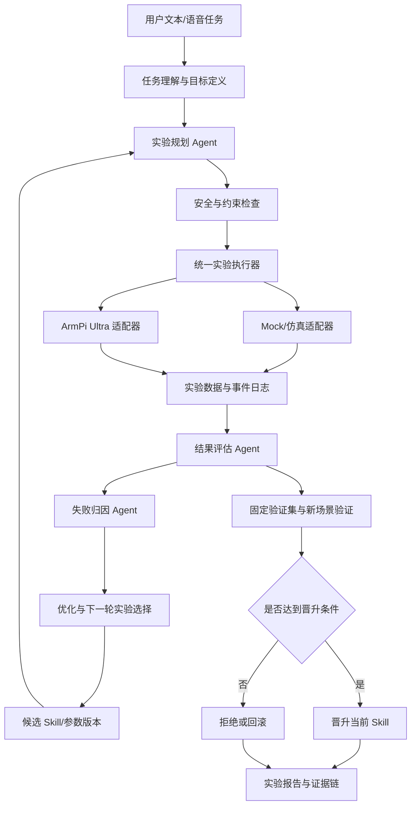

# 挑战杯机械臂项目上下文

> 用途：新会话启动时直接读取本文件，快速恢复项目背景、关键决策、当前状态和下一步工作。  
> 最后更新：2026-07-12  
> 当前唯一方向：机械臂 AI Scientist。不要将其他旧项目混入本项目。

## 1. 项目一句话定义

**基于机械臂的 AI Scientist 科学实验任务规划与自优化系统**：用户通过文本或语音下达抓取任务，智能体自主生成实验计划，调用 ArmPi Ultra 执行，读取真实实验结果，分析失败原因，更新参数或 Skill，并用重复实验和留出场景验证新方案是否应晋升或回滚。

答辩时应始终强调：本项目不是“大模型语音控制机械臂”，而是把机械臂作为可调用、可测量、可重复执行的科学实验仪器，展示“规划、执行、测量、分析、优化、再验证”的闭环。

## 2. 赛事定位

- 目标赛道：赛道一“科学问题”。
- 目标方向：方向一 B“科学实验任务规划与反馈迭代”。
- 适配逻辑：系统根据研究目标和约束设计抓取实验，运行实验并获取数据，再根据结果调整下一轮实验计划，逐步提高实验成效。
- 赛事要求中的“实验”可以由虚拟仿真或真实实验仪器执行；本项目使用真实 ArmPi Ultra，具备直观、可测量的展示优势。
- 项目创新不依赖自研机械臂、逆运动学或底层驱动。厂商现成能力是实验底座，团队原创贡献集中在 AI Scientist 闭环、失败归因、实验选择、版本管理和量化验证。

## 3. 已敲定的关键决策

### 3.1 硬件与任务边界

- 使用实验室现有 **幻尔 ArmPi Ultra**，已知具有树莓派 5、ROS2、6 自由度机械臂、夹爪、结构光深度相机、手眼标定及官方示例。
- 优先复用厂商驱动、逆运动学、相机和抓取例程，不从零研发底层控制。
- 第一版任务固定为：**抓取指定颜色方块并放置到目标区域**。
- 目标区域的左/右只是演示参数，不应写死在系统架构中。
- 当前没有现成真实数据集。数据由团队通过实机和仿真/Mock 实验自行采集，这不是选题阻断项，但自动记录、数据划分和重复实验必须尽早建立。

### 3.2 MVP 范围

MVP 必须实现：

1. 文本输入，语音可作为增强能力；
2. 结构化任务理解与实验计划生成；
3. 目标物识别和三维位置获取；
4. 安全检查及机械臂执行；
5. 抓取/放置成功检测；
6. 图像、位姿、关节状态、动作、结果和错误的自动记录；
7. 结构化失败分类与证据；
8. 至少一种可验证的参数优化；
9. Skill 新版本保存、评估、晋升和回滚；
10. 新旧版本重复实验对比；
11. 自动生成实验与迭代报告。

明确不纳入首版：

- 从零训练大型 VLA；
- 自研机械臂驱动、逆运动学或通用视觉大模型；
- 动态抓取、多机械臂协作；
- 让 LLM 绕过安全层直接产生底层舵机指令；
- 仅凭一次“第一次失败、第二次成功”宣称完成自进化。

### 3.3 自迭代的判定

以下情况不算完整自迭代：原样重试、重新拍照后执行同一策略、临时改坐标但不保存、只输出自然语言反思。

完整自迭代必须同时具备：

- 上一轮数据改变下一轮实验计划；
- 修改对象明确，例如视觉坐标残差、抓取点偏移、预抓取高度、接近方向、夹爪时机或速度；
- 修改形成可追溯的新 Skill/参数版本；
- 新版本在重复实验和未参与拟合的验证场景上评估；
- 达标才晋升，退化则回滚；
- 保存计划、数据、失败证据、修改理由、指标和决策。

### 3.4 Hermes 的使用方式

Hermes Agent 只作为“经验沉淀与 Skill 演进”思路来源，不把框架名称当成创新本身。首版借鉴：

- 情景记忆和相似失败检索；
- Skill 的版本、适用条件和历史性能；
- 候选 Skill 生成、验证、晋升和回滚；
- 跨实验复用已验证经验。

是否直接集成 Hermes 工程尚未敲定。MVP 应先把闭环和证据链做实，再决定框架级集成。

## 4. 当前事实状态

截至最后一次明确沟通，**尚未正式展开软硬件工程实现**。已经完成的是方向论证、产品规划、硬件任务拆解和暑期排期文档。

### 4.1 已完成

- [x] 机械臂方向与官方赛题的适配分析。
- [x] 项目主线、核心演示任务和自迭代判定标准。
- [x] 机械臂 AI Scientist PRD 讨论稿。
- [x] ArmPi Ultra 硬件与实验底座任务书。
- [x] 智能体侧与硬件侧职责划分及接口草案。
- [x] 七八月暑期备赛阶段性进度安排。
- [x] 基于入门手册整理已知设备能力和待验证接口。

### 4.2 尚未被证实完成

- [ ] ROS2 环境和官方例程是否已由研究生实际跑通。
- [ ] 程序化回零、关节运动、末端运动和夹爪控制。
- [ ] RGB、深度、点云和三维目标坐标读取。
- [ ] 手眼标定及重复定位误差测量。
- [ ] 抓取成功检测和实验数据自动落盘。
- [ ] 仿真环境或与实机同接口的 Mock 适配器。
- [ ] 软件后端、智能体工作流、正式 Web 前端。
- [ ] 真实机械臂联调、数据集、迭代实验和稳定演示。

> 时间提醒：原排期要求 7 月上旬启动，当前日期已是 2026-07-12。新会话的第一件事应是向硬件组核验实际进度并重排剩余七月计划，不要默认原时间表已按期执行。

## 5. 整体架构思路



### 5.1 分层架构

| 层级 | 主要职责 |
|---|---|
| 交互与展示层 | 任务输入、实验监控、相机画面、迭代曲线、Skill 版本和报告展示 |
| AI Scientist 智能体层 | 任务拆解、实验规划、执行调度、结果分析、失败归因、优化决策和报告生成 |
| 算法与工具层 | 视觉定位、坐标转换、轨迹/抓取参数、统计评估和数值优化 |
| 实验编排与安全层 | 规则校验、工作空间限制、超时、急停、异常恢复和实验批处理 |
| 设备适配层 | 厂商 SDK、ROS2、相机、机械臂、夹爪、Mock/仿真统一接口 |
| 数据与版本层 | 原始实验数据、结构化结果、验证集、Skill 版本、性能历史和报告 |

### 5.2 智能体职责

| 智能体 | 职责 |
|---|---|
| Task Interpreter | 把自然语言转为目标物、目标区、约束和成功条件 |
| Experiment Planner | 选择抓取位姿、步骤、参数、重复次数和下一轮实验 |
| Execution Orchestrator | 把计划转成确定性的设备调用，处理状态、超时和错误 |
| Evaluator | 判断抓取、提起、放置结果并计算误差、耗时等指标 |
| Failure Analysis | 根据日志、图像和数值证据定位失败阶段及候选原因 |
| Optimizer | 调用数值工具修改参数，设计验证实验，提出候选版本 |
| Memory & Skill Evolution | 检索相似经验，管理 Skill 版本、适用条件和历史性能 |
| Report Agent | 生成目标、方案、数据、迭代过程、结论和局限性报告 |

### 5.3 软件技术边界

- LLM 负责语义理解、实验规划解释、失败假设和工具编排，不直接控制舵机。
- 运动控制、坐标转换、边界检查和指标计算必须由确定性代码执行。
- 后端应提供统一 API，建议 Python + FastAPI；智能体状态机可使用 LangGraph，但最终技术栈尚需冻结。
- 正式比赛前端应采用独立 Web UI，建议 React/TypeScript；不要把 Streamlit 作为最终前端。
- Mock 执行器与真实机械臂必须实现同一接口，软件侧才能在硬件未就绪时先完成闭环。

## 6. 软硬件接口契约草案

硬件组至少需要交付以下能力：

```python
reset_home()
get_robot_state()
move_joints(joint_angles, speed)
move_to_pose(pose, speed)
open_gripper()
close_gripper(width=None, force=None)
stop()

capture_scene()
detect_objects(scene)
get_object_pose(object_id)
get_end_effector_pose()
transform_camera_to_base(pose)
estimate_measurement_confidence()
```

每个动作必须返回：成功状态、错误码、消息、开始/结束时间、关键状态和最终位姿。禁止只返回自然语言“已完成”。

每次实验至少保存：

- `experiment_id`、`task_id`、`skill_version`；
- 输入任务和结构化实验计划；
- RGB/深度/点云或其引用；
- 目标物预测位姿、机械臂执行位姿和定位误差；
- 关节状态、动作序列、耗时和路径；
- 抓取/提起/放置结果；
- 失败阶段、错误码、失败证据和候选原因；
- 本轮参数修改、候选版本和验证结论；
- 晋升、拒绝或回滚决定。

接口 Schema 目前仍是草案，必须在软硬件联调前共同冻结。

## 7. 团队分工

### 7.1 队长/智能体侧

- 总体架构和状态机；
- AI Scientist 多智能体工作流；
- Mock 执行器和后端 API；
- 失败归因、优化决策和实验选择；
- Hermes 式记忆与 Skill 版本管理；
- 数据 Schema、指标和证据链；
- 正式 Web 前端、实验看板和报告中心；
- 系统集成、演示主线和答辩技术口径。

### 7.2 研究生 A：设备控制与安全

- 官方开发环境、ROS2、SDK 和控制例程；
- 回零、关节/末端运动、夹爪、状态读取；
- 工作空间、速度、超时、急停和异常恢复；
- 统一设备接口及连续稳定性测试。

### 7.3 研究生 B：视觉感知与标定

- RGB、深度和点云读取；
- 手眼标定和相机到机械臂基坐标转换；
- 颜色方块检测、三维位姿和置信度；
- 重复定位误差和异常检测。

### 7.4 研究生 C：仿真、采集与测试

- 仿真或离线验证环境；
- 与实机一致的执行接口；
- 批量实验脚本和数据自动落盘；
- 训练/优化场景、固定验证场景、新场景分离；
- 基线、重复性和稳定性实验。

若人员不足，A 可兼仿真与安全，B 可兼实验采集，但每项交付必须落实到具体负责人。研究生还应参与文献、实验设计、统计分析、人工复核和材料工作，不能只负责 PPT。

## 8. 核心演示与证据链

演示指令示例：“把红色方块移动到目标区域。”

1. 系统识别任务，生成初始方案 `P0`。
2. 第一轮因定位偏差、抓取位姿或动作参数不佳而失败或表现较差。
3. 系统记录数据并输出有证据的失败归因。
4. 优化器修改一个明确参数集合，生成 `P1`。
5. 第二/三轮重新执行，并在重复实验中比较 `P0` 与 `P1`。
6. 在未参与拟合的新位置或新光照中验证泛化。
7. 达标则晋升 `P1`，否则拒绝或回滚。
8. 前端展示每轮计划、参数差异、误差、成功率、版本和结论。

首版优先优化一种最容易量化的变量，推荐顺序：

1. 相机坐标到机械臂基坐标的残差补偿；
2. 抓取点 `x/y/z` 偏移；
3. 预抓取高度或接近方向；
4. 夹爪闭合时机和执行速度。

## 9. 评测设计

核心指标：

- Grasp Success Rate；
- Task Completion Rate；
- Position Error 和 P95 Error；
- Execution Time；
- Path Length；
- Retry Count；
- Safety Violation；
- Generalization Rate。

最低可信评测规则：

- 优化场景与固定验证场景分离；
- 每个候选版本至少重复 10 次，比赛条件允许时应增加；
- 新版本成功率不得低于旧版本；
- 平均定位误差或任务耗时至少一项明确改善；
- 安全违规不得增加；
- 至少包含一个新位置、新方向或新光照场景；
- 至少展示一个未晋升或被回滚的候选版本。

## 10. 七八月基线计划

> 这是 2026-07-06 形成的基线计划。当前日期已超过其中“7 月上旬”节点，必须根据真实进展更新。

| 时间 | 硬件/研究生侧 | 软件/智能体侧 | 目标产出 |
|---|---|---|---|
| 7 月上旬 | 读通手册，搭建 ROS2/官方环境，确认基础控制链路 | 冻结 PRD、架构和接口，确定技术栈 | 环境清单、接口草案 |
| 7 月中旬 | 回零、移动、夹爪、视觉读取、仿真/调试 | 后端 API、智能体工作流、实验日志、Web 控制台初版 | 硬件基础 Demo、软件 Mock 闭环 |
| 7 月下旬 | 基础抓取、数据采集和误差测量 | 失败归因、版本管理、优化器和可联调底座 | 第一版数据集、可联调版本 |
| 8 月上旬 | 提供真实机械臂 API 并配合调试 | Mock 切换为实机适配器 | 真实机械臂单轮闭环 |
| 8 月中旬 | 批量实验和失败案例采集 | 多轮反馈、策略更新和效果对比 | 稳定演示版本、自优化数据 |
| 8 月下旬 | 录制视频、整理实验和硬件说明 | 完成 Web 前端、报告、PPT、申报与答辩材料 | 可提交的稳定比赛版本 |

### 7 月底“可联调版本”标准

- 任务输入后可完成目标解析、计划生成、Mock 执行、结果记录、失败归因和下一轮方案生成；
- 前端能展示状态、日志、失败原因、指标和 Skill 版本变化；
- 后端预留并通过测试的真实机械臂适配接口。

### 8 月底“可提交稳定版本”标准

- 真实机械臂稳定完成颜色方块抓取与放置；
- 至少展示 2-3 轮有证据的反馈迭代；
- 形成稳定前后端、结构化实验数据集和完整复现说明；
- 准备现场演示、预录视频和 Mock/仿真三重兜底；
- 完成技术报告、申报材料、PPT 和答辩问答。

## 11. 下一步待办

### P0：立即执行

- [ ] 向硬件组核验截至 2026-07-12 的真实进度、负责人和设备可用时间。
- [ ] 执行三天接口调查：设备版本、ROS2 节点/Topic/Service/Action、源码、配置和官方例程。
- [ ] 完成七天硬件可行性闸门，不通过闸门不进入实机自迭代开发。
- [ ] 冻结 `ExperimentPlan`、`ExperimentResult`、设备适配器和错误码 Schema。
- [ ] 决定软件仓库位置、正式技术栈和团队协作方式。
- [ ] 定义颜色方块、目标区、相机位置、工作空间和成功判据。

### P1：七月可联调底座

- [ ] 实现 Mock 执行器和可复现失败注入。
- [ ] 实现任务解释、实验规划、执行编排、评估和日志主链路。
- [ ] 实现至少一种失败归因和参数优化。
- [ ] 实现 Skill 版本保存、比较、晋升和回滚。
- [ ] 建立实验数据目录、训练/验证/泛化场景划分。
- [ ] 搭建正式 Web 控制台的核心页面。

### P2：八月实机与比赛交付

- [ ] 接入真实 ArmPi Ultra 适配器。
- [ ] 完成单轮闭环和批量重复实验。
- [ ] 完成多轮优化、验证和失败版本回滚演示。
- [ ] 打磨现场稳定性、异常恢复和演示兜底。
- [ ] 生成报告、视频、PPT、申报材料和复现文档。

## 12. 硬件可行性闸门

进入智能体实机开发前，硬件组必须证明：

- [ ] 代码可初始化、回零、读取关节状态；
- [ ] 可执行指定关节角和末端位姿；
- [ ] 可控制夹爪并连续执行 20 次无失控；
- [ ] 可获取 RGB、深度/点云和目标三维位置；
- [ ] 可量化手眼标定与重复定位误差；
- [ ] 可独立判断抓取成功或失败；
- [ ] 单次实验数据可自动落盘并通过 ID 追溯；
- [ ] 校准参数可版本化保存和恢复；
- [ ] 越界、超时、低置信度和急停测试通过；
- [ ] 提供 Mock 或仿真适配器；
- [ ] 上层无需依赖人工点击厂商 GUI 执行核心任务。

闸门判定：

- 全部通过：进入实机自迭代开发；
- 能控制但不能测量结果：暂缓自迭代，只能做控制 Demo；
- 只能运行厂商 GUI/示例：风险过高，不能作为比赛主线成果；
- 硬件任务最终转嫁给队长：重新评估团队分工和进度。

## 13. 主要风险

| 风险 | 应对 |
|---|---|
| 团队无人熟悉机械臂 | 用七天硬件闸门代替口头承诺，按接口和测试验收 |
| 厂商软件封闭 | 优先确认 ROS2/SDK；上层只依赖统一适配器 |
| 无成功检测 | 优先实现物体提起和目标区检测，否则无法证明闭环 |
| 视觉定位不稳定 | 先固定颜色方块、工作台和有限位置，再逐步扩展 |
| 偶然失败后偶然成功 | 每版本重复实验，使用固定验证集和泛化场景 |
| LLM 产生危险动作 | LLM 只产出计划，确定性安全层审批后执行 |
| 优化过拟合固定位置 | 优化集、验证集和新场景严格分离 |
| 新版本性能下降 | 候选版本不直接替换稳定版，验证失败自动回滚 |
| 实机现场不稳定 | 现场稳定任务 + 预录视频 + Mock/仿真兜底 |
| 排期已落后基线 | 立即做进度核验，缩小 MVP，优先保障闭环证据 |

## 14. 重要文件与修改记录

以下是当前机械臂项目的有效文件。新会话应优先读取 Markdown 源文件，Word 文件用于沟通和汇报。

| 日期 | 文件 | 作用与状态 |
|---|---|---|
| 2026-07-14 | `docs/成员任务进度阶段表.md` | 六名成员个人阶段任务与状态维护表；用于周会更新和证据归档 |
| 2026-07-14 | `docs/2026-07-14至08-31项目进度计划.md` | 当前执行基线；按周维护任务状态、闸门、证据和计划偏差 |
| 2026-06-19 | `outputs/机械臂_AI_Scientist_PRD.md` | 机械臂主 PRD，v0.1 讨论稿；定义赛题适配、自迭代、架构、分工、接口和验收 |
| 2026-06-19 | `outputs/机械臂_AI_Scientist_PRD.docx` | 上述 PRD 的 Word 版本 |
| 2026-06-19 | `build_robot_prd_docx.py` | 生成机械臂 PRD Word 的脚本 |
| 2026-06-19 | `outputs/ArmPi_Ultra硬件与实验底座任务书.md` | 给硬件/研究生侧的技术调查、七天闸门、接口和交付任务书 |
| 2026-06-19 | `outputs/ArmPi_Ultra硬件与实验底座任务书.docx` | 硬件任务书 Word 版本 |
| 2026-06-19 | `build_hardware_task_docx.py` | 生成硬件任务书 Word 的脚本 |
| 2026-07-06 | `outputs/挑战杯暑期备赛阶段性进度安排汇报.docx` | 面向学院暑期备赛会的阶段性排期汇报；其中日期和当前阶段需按最新进度更新 |
| 2026-07-06 | `build_summer_report_docx.py` | 生成暑期阶段性汇报 Word 的脚本 |
| 2026-07-12 | `挑战杯.md` | 当前会话交接总览，作为新会话首要加载文件 |

外部参考资料：

- `C:\Users\11869\Desktop\ArmPi Ultra使用入门手册.pdf`
- 官方赛题页面：<https://university.aliyun.com/action/tzbjbgs2026>

## 15. 文档间需统一的事项

- 最新对外项目名采用“基于机械臂的 AI Scientist 科学实验任务规划与自优化系统”；旧 PRD 中的 RoboScientist/EvoGrasp 等仅为候选名。
- 原 PRD 示例写“右侧目标区”，暑期汇报写“左侧目标区”；系统应统一为可配置的“目标区域”。
- 机械臂 PRD 仍标记为 v0.1 讨论稿，接口 Schema、正式技术栈、人员名单和数据格式尚未冻结。
- 暑期汇报中的“7 月上旬”已过期，不能直接当作当前进度陈述。
- 当前文件记录的是规划成果，不等于代码、硬件或实验成果已经完成。

## 16. 新会话接管顺序

1. 读取本文件。
2. 读取 `outputs/机械臂_AI_Scientist_PRD.md` 和 `outputs/ArmPi_Ultra硬件与实验底座任务书.md`。
3. 询问或检查硬件组最新交付，不沿用 2026-07-06 的进度假设。
4. 更新项目状态和剩余排期。
5. 冻结软硬件接口及数据 Schema。
6. 先完成 Mock 闭环，再接真实机械臂。
7. 所有开发和汇报围绕“反馈改变下一轮实验，并被量化验证”这一核心证据展开。
