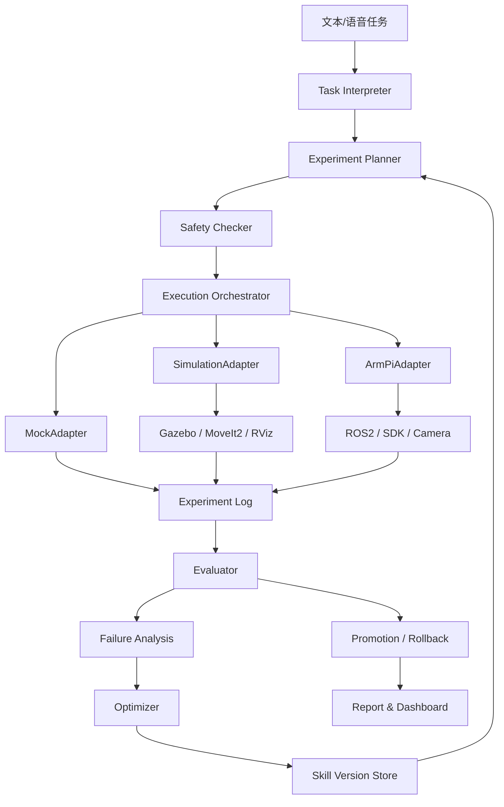

# 机械臂 AI Scientist PRD v1

> 文档版本：v1.0  
> 日期：2026-07-20  
> 项目周期：2026-07-14 至 2026-08-31  
> 项目方向：挑战杯赛道一，方向一 B，科学实验任务规划与反馈迭代  
> 当前状态：PRD 初版可用于软件开发与硬件交付对齐；完整实机抓取闭环仍待验证。

## 1. 项目概述

### 1.1 项目名称

暂定名称：RoboScientist：基于自进化智能体的机械臂自主实验与反馈优化系统。

备选名称：

- EvoGrasp：机械臂抓取实验自进化智能体
- ArmLab-Agent：机械臂自主实验与反馈迭代平台
- Embodied Scientist：具身科学实验智能体

### 1.2 一句话定义

本项目将 ArmPi Ultra 机械臂作为可调用、可测量、可重复执行的实验仪器，构建一个能够根据实验结果调整下一轮抓取计划，并通过重复实验验证参数或 Skill 是否应晋升或回滚的 AI Scientist 系统。

### 1.3 核心定位

本项目不是“大模型语音控制机械臂”，也不是展示厂商机械臂已有的单次识别抓取能力。项目重点是展示：

```text
任务输入 -> 实验计划 -> 安全执行 -> 数据记录 -> 失败分析 -> 参数/Skill 更新 -> 重复验证 -> 晋升/回滚
```

即 AI 如何根据虚拟仿真、真实实验仪器或 Mock 兜底数据改变下一轮计划，并逐步提高实验成效。

## 2. 赛题适配

### 2.1 对应赛题方向

- 赛道：赛道一，科学问题。
- 方向：方向一 B，科学实验任务规划与反馈迭代。
- 适配理由：机械臂可以作为虚拟仿真对象或真实实验仪器，执行可重复的抓取实验；系统根据实验结果调整下一轮实验参数，形成可追溯的实验优化闭环。当前主 demo 优先接入 Gazebo/MoveIt2 虚拟仿真，后续升级到真实机械臂。

### 2.2 与普通机械臂项目的区别

本项目不把以下内容作为核心创新：

- 厂商机械臂底层驱动；
- 厂商逆运动学；
- 厂商颜色识别或 RGB-D 示例；
- 单次语音控制机械臂；
- 单次抓取成功；
- 失败后原样重试；
- LLM 输出自然语言“反思”但没有改变可执行参数。

本项目的核心创新是：

- 把任务转成结构化实验计划；
- 把执行过程转成可复算实验数据；
- 根据失败阶段和数值证据更新明确参数；
- 保存新的 Skill/参数版本；
- 通过重复实验和固定验证集决定晋升、拒绝或回滚；
- 自动生成实验过程与证据链报告。

## 3. 问题定义

### 3.1 用户问题

在机械臂抓取任务中，失败常来自视觉定位误差、抓取点偏移、夹爪开合参数、预抓取高度、运动路径或场景扰动。传统演示通常只展示一次成功结果，缺少对失败的结构化分析、参数演进和重复验证。

本项目要解决的问题是：

> 当机械臂执行抓取任务失败或表现不佳时，AI 能否利用实验数据定位问题，生成下一轮更合理的实验计划，并用量化指标验证改进是否真实有效？

### 3.2 第一版实验任务

MVP 固定为受控场景下的颜色方块抓取：

```text
用户输入：抓取指定颜色方块，并放置到目标区域。
系统输出：实验计划、执行日志、结果判断、失败分析、参数更新和版本决策。
```

初始场景保持简单：

- 固定工作台；
- 固定相机；
- 固定光照；
- 固定尺寸颜色方块；
- 固定目标区域；
- 每次只处理一个明确目标物；
- 先支持文本输入，语音作为增强。

## 4. 产品目标与非目标

### 4.1 MVP 目标

MVP 必须实现以下能力：

1. 文本任务输入，语音输入作为可选增强；
2. 将自然语言任务转成结构化 `TaskSpec`；
3. 生成可执行 `ExperimentPlan`；
4. 通过确定性安全层检查动作参数；
5. 支持 Mock 执行器完成端到端闭环，作为开发、测试和无仿真环境兜底；
6. 支持 Gazebo/MoveIt2 `SimulationAdapter` 作为当前主 demo 执行层；
7. 支持真实机械臂适配器逐步接入；
8. 记录实验计划、动作、状态、视觉、结果和错误；
9. 判断抓取、提起、放置是否成功；
10. 根据失败证据生成一个候选参数或 Skill 版本；
11. 对新旧版本进行重复实验比较；
12. 满足晋升条件才替换稳定版本，不满足则拒绝或回滚；
13. 自动生成实验报告和证据链。

### 4.2 P1 增强目标

P1 可扩展：

- 语音输入和语音反馈；
- 多颜色方块和多个目标区；
- 新位置、方向、光照变化下的泛化测试；
- 更精细的路径长度、耗时、成功率联合优化；
- 相似失败案例检索；
- Hermes 式 Skill 记忆与复用；
- Gazebo/MoveIt2 仿真、实机、录屏和 Mock 四层演示兜底。

### 4.3 非目标

首版不做：

- 从零训练大型 VLA 或视觉基础模型；
- 自研机械臂驱动、舵机协议或逆运动学；
- 自研通用目标检测模型；
- 动态抓取；
- 多机械臂协作；
- 无安全层的自动运动；
- 让 LLM 直接输出舵机 ID、脉宽、duration 作为最终控制；
- 只用一次失败和一次成功证明自进化。

## 5. 当前事实状态

### 5.1 已验证事实

来自 2026-07-17 实机运行手册和项目交接记录，当前已验证：

| 能力 | 状态 | 证据/说明 |
|---|---|---|
| Python 控制夹爪开合 | 已跑通 | 通过 ROS2 Topic 控制 Servo 1 |
| 读取 1-6 号舵机位置 | 已跑通 | 通过 ROS2 Service 逐个读取，避免一次读取六个导致卡住 |
| 保存当前舵机位置为 Home | 已跑通 | 保存到树莓派 `~/my_armpi/home.json` |
| 恢复到保存的 Home | 已跑通 | `home_control.py` 读取 JSON 后发布舵机位置 |
| Windows 下载状态 JSON | 已跑通 | 树莓派 HTTP 服务 + Windows `download_home.py` |
| 机械臂 AP 地址 | 已使用 | `192.168.149.1` |

已跑通接口：

| 类型 | 名称 | 消息/服务 |
|---|---|---|
| Topic | `/ros_robot_controller/bus_servo/set_position` | `ros_robot_controller_msgs/msg/ServosPosition` |
| Service | `/ros_robot_controller/bus_servo/get_state` | `ros_robot_controller_msgs/srv/GetBusServoState` |

已跑通脚本：

- `robot_control.py`：夹爪开合、自定义夹爪位置、读取六个舵机；
- `home_control.py`：保存 Home、显示 Home、恢复 Home；
- `download_home.py`：Windows 端下载树莓派 `home.json` 并按时间保存。

夹爪参数当前只作为本机初步测试值：

| 动作 | 舵机 ID | 测试 position |
|---|---:|---:|
| 夹爪打开 | 1 | 400 |
| 夹爪闭合 | 1 | 600 |

注意：源码示例中也出现过其他夹爪值，例如 210/600。因此 PRD 不把 400/600 写成通用事实，只写成当前测试配置，后续必须版本化。

### 5.2 源码/资料级事实

来自硬件认知报告和源码/手册资料：

- ArmPi Ultra 可抽象为树莓派 5 / Ubuntu / ROS2 + STM32 控制器 + 6 个总线舵机；
- 机械臂主体为 5 个运动关节，夹爪为第 6 个独立舵机；
- 运动学模块主要求解主体 5 个关节；
- `/kinematics/*` 服务主要用于正逆运动学求解，不等于真实执行；
- 真实执行需要将求解结果转换为舵机控制消息并发布到执行 Topic；
- Aurora 930 深度相机资料显示支持 RGB、深度、红外和内参输出，但当前设备实际相机能力仍需实机确认；
- 厂商源码已有颜色识别、RGB-D、点云、目标跟踪、抓取和语音示例，这些应视为实验底座。

### 5.3 仍待实机验证

当前不能直接宣称完成：

- 主体关节安全小幅运动；
- 完整 `move_to_pose` 执行链路；
- RGB-D 图像、深度图、点云在当前设备上的实时读取；
- 颜色方块检测输出字段；
- `camera -> base` 标定参数和重复定位误差；
- 抓取、提起、放置成功判定；
- 连续基础动作 20 次稳定性；
- 真实反馈迭代效果；
- 实机安全工作空间与桌面碰撞边界；
- 电压、温度、扭矩、碰撞等遥测在当前运行节点中的可用性。

## 6. 用户与使用场景

### 6.1 目标用户

- 机器人实验研究人员；
- 机械臂算法开发者；
- 科学实验自动化场景中的任务规划研究者；
- 比赛评委和指导教师。

### 6.2 核心演示流程

用户输入：

```text
把红色方块抓起来，放到目标区域。
```

系统执行：

1. 解析目标：红色方块、目标区域、固定场景约束；
2. 读取场景：RGB-D 图像、目标检测、目标位姿；
3. 生成计划：抓取点、预抓取高度、接近路径、夹爪参数；
4. 安全检查：工作空间、速度、超时、置信度、标定版本；
5. 执行实验：机械臂移动、夹爪闭合、提起、放置；
6. 记录结果：动作、状态、图像、位姿、耗时、结果；
7. 评估失败：定位偏差、夹爪未夹住、路径超时等；
8. 生成候选版本：修改一个参数族；
9. 重复验证：对 P0/P1 进行固定验证；
10. 版本决策：晋升、拒绝或回滚；
11. 输出报告：展示数据、证据和结论。

## 7. AI Scientist 闭环

### 7.1 闭环定义

一次有效自迭代必须满足：

- 上一轮实验数据改变下一轮计划；
- 改动对象明确且可执行；
- 改动形成新参数或 Skill 版本；
- 新版本在重复实验中验证；
- 固定验证集不被优化器直接拟合；
- 达标才晋升，不达标则拒绝或回滚；
- 全过程有实验 ID、数据、日志和报告。

### 7.2 不算自迭代的情况

- 原样重试；
- 重新拍照但参数不变；
- 手动调参数但不保存版本；
- 只输出自然语言反思；
- 只展示一次失败后成功；
- 只用厂商 GUI 演示抓取。

### 7.3 首个优化变量选择

首个真实优化变量不在 PRD 中预先写死，需根据 P0 基线证据选择。候选优先级：

| 失败证据 | 可优化参数族 |
|---|---|
| 稳定定位偏差 | `camera -> base` 残差补偿或抓取点偏移 |
| 抓取末端高度不稳定 | 预抓取高度、下降深度 |
| 夹爪未夹住 | 夹爪闭合 position、闭合时机 |
| 路径耗时过长 | 中间 waypoint、速度上限 |
| 低置信度/深度异常 | 感知拒绝阈值、重新观测策略 |

每一轮候选版本只允许修改一个参数族。

## 8. 系统架构

### 8.1 总体架构



### 8.2 分层职责

| 层级 | 职责 |
|---|---|
| 交互层 | 文本/语音输入、任务确认、实验看板、报告展示 |
| 智能体层 | 任务解释、实验规划、失败归因、优化解释、报告生成 |
| 编排层 | 状态机、动作顺序、超时、错误处理、批量实验 |
| 安全层 | 工作空间、速度、姿态、置信度、标定版本、急停状态检查 |
| 适配层 | MockAdapter、SimulationAdapter 与 ArmPiAdapter 统一接口 |
| 仿真/硬件层 | Gazebo、MoveIt2、RViz、ROS2、SDK、运动学、相机、舵机、夹爪 |
| 数据层 | 实验记录、原始工件、Schema、Skill 版本、指标统计 |

## 9. 核心模块需求

### 9.1 Task Interpreter

输入：自然语言或语音转写文本。

输出：`TaskSpec`。

职责：

- 识别目标颜色、目标物、目标区；
- 识别约束，例如固定场景、低速、安全模式；
- 对不明确任务要求澄清；
- 不生成底层动作参数。

### 9.2 Experiment Planner

输入：`TaskSpec`、场景配置、Skill 历史。

输出：`ExperimentPlan`。

职责：

- 选择当前 Skill 版本；
- 生成抓取步骤；
- 指定可调参数；
- 指定需要采集的数据；
- 调用安全层预检查。

### 9.3 Execution Orchestrator

输入：`ExperimentPlan`。

输出：`ExperimentResult`。

职责：

- 把计划拆成确定性动作；
- 调用 `ArmAdapter` 或 `MockAdapter`；
- 处理超时、失败、拒绝、停止；
- 保存事件日志和原始工件引用。

### 9.4 Evaluator

职责：

- 判断抓取、提起、放置结果；
- 计算任务完成率、误差、耗时；
- 标记失败阶段；
- 输出可供失败分析使用的结构化证据。

### 9.5 Failure Analysis

职责：

- 根据结果、图像、位姿、动作事件定位失败原因；
- 输出候选原因和证据；
- 只允许输出可验证假设；
- 不允许用纯自然语言“猜测成功原因”替代数据。

### 9.6 Optimizer

职责：

- 根据失败分析选择一个参数族；
- 生成候选 Skill 版本；
- 设计验证实验；
- 根据晋升规则输出决策建议。

### 9.7 Skill Version Store

职责：

- 保存 Skill 参数、适用场景、版本来源；
- 保存每个版本的历史表现；
- 支持晋升、拒绝、回滚；
- 支持查询相似失败案例。

### 9.8 Report Agent

职责：

- 自动生成实验报告；
- 展示任务、计划、执行、失败原因、参数改动、指标变化；
- 区分真实实机结果、Mock 结果和人工复核内容。

## 10. 数据 Schema 初稿

### 10.1 TaskSpec

```json
{
  "task_id": "task-20260720-001",
  "input_text": "抓取红色方块并放到目标区域",
  "target_object": {
    "type": "cube",
    "color": "red"
  },
  "target_area": {
    "area_id": "place-zone-v0"
  },
  "constraints": {
    "scene_id": "fixed-cube-scene-v0",
    "safety_profile": "bench-safe-v0",
    "allow_real_robot": false
  }
}
```

### 10.2 ExperimentPlan

```json
{
  "experiment_id": "exp-20260720-001",
  "task_id": "task-20260720-001",
  "skill_version": "grasp-red-cube-p0",
  "adapter": "mock",
  "scene_id": "fixed-cube-scene-v0",
  "calibration_version": "cal-v0",
  "steps": [
    {"name": "capture_scene"},
    {"name": "detect_object", "object_filter": {"color": "red"}},
    {"name": "transform_camera_to_base"},
    {"name": "pre_grasp", "params": {"height_m": 0.08}},
    {"name": "close_gripper"},
    {"name": "lift"},
    {"name": "place"},
    {"name": "open_gripper"},
    {"name": "return_home"}
  ],
  "safety_constraints": {
    "workspace_profile": "bench-v0",
    "max_duration_s": 30,
    "min_measurement_confidence": 0.85
  }
}
```

### 10.3 RobotActionResult

```json
{
  "action_id": "act-001",
  "name": "close_gripper",
  "status": "succeeded",
  "started_at": "2026-07-20T10:00:00+08:00",
  "ended_at": "2026-07-20T10:00:01.5+08:00",
  "command": {
    "interface": "gripper",
    "position": 600,
    "duration_s": 1.5
  },
  "final_robot_state": {
    "servos": {"1": 598}
  },
  "error_code": null,
  "safety_events": [],
  "artifacts": {
    "ros_log": "path-or-uri"
  }
}
```

### 10.4 ObjectPose

```json
{
  "object_id": "red-cube-01",
  "frame_id": "camera",
  "pose": {
    "position": {"x": 0.12, "y": 0.03, "z": 0.42, "unit": "m"},
    "orientation": {"x": 0, "y": 0, "z": 0, "w": 1}
  },
  "confidence": 0.91,
  "source": {
    "rgb": "path-or-uri",
    "depth": "path-or-uri",
    "camera_info": "path-or-uri"
  }
}
```

### 10.5 ExperimentResult

```json
{
  "experiment_id": "exp-20260720-001",
  "task_id": "task-20260720-001",
  "adapter": "mock",
  "skill_version": "grasp-red-cube-p0",
  "scene_id": "fixed-cube-scene-v0",
  "calibration_version": "cal-v0",
  "status": "failed",
  "object": {
    "id": "red-cube-01",
    "camera_pose": {"x": 0.12, "y": 0.03, "z": 0.42, "unit": "m"},
    "base_pose": {"x": 0.20, "y": -0.05, "z": 0.08, "unit": "m"},
    "confidence": 0.91
  },
  "actions": [],
  "outcome": {
    "grasped": false,
    "lifted": false,
    "placed": false,
    "task_success": false,
    "position_error_m": null
  },
  "failure": {
    "stage": "grasp",
    "category": "gripper_parameter_or_pose_offset",
    "evidence": ["gripper closed but object remained on table"]
  },
  "metrics": {
    "duration_s": 18.2,
    "safety_event_count": 0
  },
  "artifacts": {
    "rgb": "path-or-uri",
    "depth": "path-or-uri",
    "robot_log": "path-or-uri",
    "video": "path-or-uri"
  }
}
```

### 10.6 SkillVersion

```json
{
  "skill_id": "color_cube_grasp",
  "version": "p1",
  "parent_version": "p0",
  "changed_parameter_family": "grasp_offset",
  "parameters": {
    "grasp_offset_m": {"x": 0.005, "y": 0.0, "z": 0.0},
    "pre_grasp_height_m": 0.08,
    "gripper_close_position": 600
  },
  "applicable_scene": ["fixed-cube-scene-v0"],
  "created_from_experiment": "exp-20260720-001",
  "promotion_status": "candidate"
}
```

## 11. 硬件接口需求

### 11.1 ArmAdapter 接口

上层软件只允许调用项目自己的 `ArmAdapter`，不得直接依赖厂商 ROS2 Topic、Service、舵机 ID 或脉宽。

建议接口：

```python
reset_home() -> RobotActionResult
get_robot_state() -> RobotState
move_joints(joint_targets, duration) -> RobotActionResult
solve_pose(pose, pitch_range) -> KinematicsResult
move_to_pose(pose, speed, safety_context) -> RobotActionResult
open_gripper(config) -> RobotActionResult
close_gripper(config) -> RobotActionResult
stop(reason) -> RobotActionResult
capture_scene() -> SceneObservation
get_object_pose(object_id) -> ObjectPose
transform_camera_to_base(pose, calibration_version) -> ObjectPose
```

### 11.2 运动学求解与执行分离

真实执行链路必须拆开：

```text
目标位姿
 -> 安全检查
 -> 运动学求解
 -> 解有效性检查
 -> 舵机/关节目标生成
 -> 执行 Topic
 -> 状态读取
 -> 结果判断
```

`/kinematics/*` 不能被当作动作成功。只有机械臂实际移动并返回状态，才能生成 `RobotActionResult.status = succeeded`。

### 11.3 MockAdapter

MockAdapter 必须与 ArmAdapter 使用同一业务接口，并支持：

- 成功执行；
- 定位偏差；
- 抓取失败；
- 低置信度拒绝；
- 超时；
- 安全拦截；
- 候选版本改进；
- 候选版本退化和回滚。

## 12. 安全与约束

### 12.1 不可突破规则

- LLM 不直接控制舵机；
- LLM 不生成最终脉宽或关节命令；
- 任何动作执行前必须通过安全层；
- 安全层失败时不得自动重试；
- 急停或停止后不得自动续跑；
- 标定版本、场景版本、设备配置变化必须记录；
- 扭矩、电流、碰撞不可用时，不作为 MVP 硬依赖，但必须记录不可用结论。

### 12.2 安全检查项

安全层至少检查：

| 检查项 | MVP 要求 |
|---|---|
| 舵机 ID | 只允许设备配置中声明的 ID |
| 脉宽范围 | 必须在配置范围内 |
| 工作空间 | 不允许桌面以下或禁入区 |
| 速度/时长 | 采用保守速度与超时 |
| 目标置信度 | 低于阈值拒绝执行 |
| 标定版本 | 缺失或过期拒绝执行 |
| 设备状态 | SDK 未启动或状态过期拒绝执行 |
| 停止状态 | 急停/停止后必须人工确认恢复 |

## 13. 反馈迭代与版本机制

### 13.1 版本生成

当实验失败或指标不佳时，系统生成候选版本。候选版本必须包含：

- 父版本；
- 修改参数族；
- 修改值；
- 修改原因；
- 来源实验 ID；
- 适用场景；
- 预期改善指标；
- 安全检查结果。

### 13.2 晋升规则

候选版本只有同时满足以下条件才能晋升：

1. 安全事件不增加；
2. 任务完成率或抓取成功率不下降；
3. 定位误差、耗时或路径长度至少一项改善；
4. 固定验证集结果不退化；
5. 每个版本至少完成规定次数重复实验；
6. 数据、日志和失败样本完整保留。

不满足条件时，候选版本被拒绝或回滚。

## 14. 评估指标

### 14.1 核心指标

| 指标 | 含义 |
|---|---|
| `task_success_rate` | 完整任务成功率 |
| `grasp_success_rate` | 抓取成功率 |
| `lift_success_rate` | 提起成功率 |
| `place_success_rate` | 放置成功率 |
| `position_error_m` | 放置或定位误差 |
| `duration_s` | 实验总耗时 |
| `path_length_m` | 末端路径长度，若可获取 |
| `safety_event_count` | 安全事件数量 |
| `rollback_count` | 候选版本回滚次数 |

### 14.2 数据划分

| 数据集 | 用途 |
|---|---|
| 优化集 | 用于发现问题和生成候选版本 |
| 固定验证集 | 用于新旧版本公平比较 |
| 泛化集 | 用于新位置、方向或光照测试 |
| 安全集 | 用于不可达、低置信度、越界和超时测试 |

优化集和固定验证集不得混用。

## 15. 前端与演示需求

### 15.1 MVP 看板

MVP 看板应展示：

- 当前任务；
- 实验计划；
- 执行步骤状态；
- Mock/仿真/实机适配器状态；
- 图像或工件引用；
- 失败阶段；
- 参数版本差异；
- 指标对比；
- 晋升/回滚决策。

### 15.2 比赛演示重点

演示应突出：

- 虚拟仿真或真实机械臂作为可执行、可观测的实验环境；
- AI 不是只执行一次，而是根据结果改变下一轮计划；
- 新旧版本有数据比较；
- 失败版本会被拒绝或回滚；
- 厂商能力与团队原创闭环清楚区分。

## 16. 阶段计划与验收

### 16.1 P0：接口、Mock 与仿真准备

完成标准：

- PRD v1 完成；
- `ExperimentPlan`、`ExperimentResult`、`RobotActionResult`、`ObjectPose`、`SkillVersion` 初稿冻结；
- MockAdapter 可模拟至少四类结果；
- 定义 `SimulationAdapter` 接口与 `data_source = "simulation"` 结果结构；
- 研究生验证 Gazebo/MoveIt2 官方链路能否启动并导出 ROS2 topic/action/service；
- 夹爪和舵机状态读取实机证据归档；
- 硬件组明确下一批实机验证任务。

### 16.2 P1：Mock 最小闭环与仿真模式骨架

完成标准：

- 文本任务可生成实验计划；
- Mock 执行可生成完整实验结果；
- 支持成功、定位偏差、抓取失败、超时；
- 能生成候选 Skill 版本；
- 能执行一次晋升或回滚示例。
- API/前端支持执行模式切换：`mock`、`simulation`、`real_arm_stub`；
- 仿真模式在无 ROS2 环境时返回明确的 `simulation_runtime_unverified`，不伪造真实仿真结果。

### 16.3 P2：Gazebo/MoveIt2 虚拟仿真闭环

完成标准：

- Gazebo/MoveIt2 可启动官方 ArmPi Ultra 模型；
- 系统可通过 `SimulationAdapter` 发起一次规划请求或读取规划结果；
- 返回规划成功、碰撞状态、规划器名称、规划时间、轨迹长度、轨迹点等结构化数据；
- 前端可展示仿真数据来源、轨迹/流程示意和迭代前后指标对比；
- 能用至少两轮仿真结果展示一次参数或 Skill 迭代。

### 16.4 P3：实机单轮闭环

完成标准：

- 真实 ArmAdapter 可接入；
- 能读取视觉目标；
- 能完成安全动作链；
- 能生成一条完整真实 `ExperimentResult`；
- 结果能被报告和看板读取。

### 16.4 P3：真实优化验证

完成标准：

- P0/P1 各完成至少 10 次重复实验；
- 生成指标对比；
- 满足规则则晋升，不满足则回滚；
- 保留失败样本和原始数据。

### 16.5 P4：比赛冻结

完成标准：

- 完成 2-3 轮可演示迭代；
- 报告、PPT、视频和复现说明完成；
- Gazebo/MoveIt2 仿真、实机、录屏、Mock 四条演示路径可用；
- 所有结论可追溯到实验 ID。

## 17. 风险与降级方案

| 风险 | 影响 | 降级方案 |
|---|---|---|
| 实机主体运动不稳定 | 真实抓取闭环延期 | 先用 Gazebo/MoveIt2 仿真完成主闭环，Mock 作为兜底，实机只展示夹爪/状态读取和基础动作 |
| RGB-D 或视觉接口未跑通 | 无法真实定位目标 | 使用固定坐标或离线样例演示，明确标为非完整实机闭环 |
| 标定误差不可控 | 抓取成功率低 | 优先优化抓取点偏移或夹爪参数，减少场景复杂度 |
| 急停/停止接口不足 | 安全风险 | 使用物理断电、低速、人工监护、保守工作空间 |
| 真实实验次数不足 | 晋升证据不强 | 保留仿真重复实验和 Mock 回归测试，真实数据只作为初步验证 |
| 厂商已有功能掩盖创新 | 答辩价值被质疑 | 明确厂商是执行底座，原创是反馈迭代和版本决策 |

## 18. 硬件组待补资料

PRD v1 后，硬件侧优先补：

1. 三个已跑通脚本原文件、运行日志和真实 JSON；
2. 夹爪打开/闭合/抓方块推荐值和连续稳定性；
3. 主体关节低速小幅运动记录；
4. ROS2 `topic list`、`service list`、关键 `interface show`；
5. RGB、深度、CameraInfo 样例；
6. 颜色方块检测输出字段；
7. `camera -> base` 转换样例和标定版本；
8. 工作台尺寸、目标区位置、安全边界和急停恢复；
9. 一条完整实验包目录结构。

## 19. 附录：当前关键接口证据

### 19.1 已跑通夹爪控制命令

打开夹爪：

```bash
ros2 topic pub --once \
  /ros_robot_controller/bus_servo/set_position \
  ros_robot_controller_msgs/msg/ServosPosition \
  "{duration: 1.5, position: [{id: 1, position: 400.0}]}"
```

闭合夹爪：

```bash
ros2 topic pub --once \
  /ros_robot_controller/bus_servo/set_position \
  ros_robot_controller_msgs/msg/ServosPosition \
  "{duration: 1.5, position: [{id: 1, position: 600.0}]}"
```

读取 Servo 1：

```bash
timeout 15s ros2 service call \
  /ros_robot_controller/bus_servo/get_state \
  ros_robot_controller_msgs/srv/GetBusServoState \
  "{cmd: [{id: 1, get_position: 1}]}"
```

### 19.2 当前运行链路

```text
树莓派终端 1：~/.stop_ros.sh && ros2 launch sdk armpi_ultra.launch.py
树莓派终端 2：cd ~/my_armpi && python3 robot_control.py
树莓派终端 3：cd ~/my_armpi && python3 -m http.server 8000 --bind 0.0.0.0
Windows：python download_home.py
```

### 19.3 参考文档

- `docs/挑战杯.md`
- `docs/2026-07-14至08-31项目进度计划.md`
- `docs/硬件开发实施手册.md`
- `docs/2026-07-17_周末异地工作交接文档.md`
- `docs/机械臂硬件资料认知与PRD对接报告.md`
- `docs/硬件资料/ArmPi_Ultra_已跑通程序与运行手册.docx`
- `docs/硬件资料/ArmPi_Ultra_资料整理.md`

## 20. 开发启动口径

### 20.1 当前开发结论

PRD v1 已可作为软件开发起点。软件侧不等待完整实机抓取闭环，但主 demo 不再停留于纯 Mock 流程展示：当前优先形成 `MockAdapter` 兜底闭环、`SimulationAdapter` 仿真接口骨架、Schema、适配器抽象、安全层和版本决策。硬件/仿真侧继续补 Gazebo/MoveIt2 启动证据、ROS2 topic/action/service、视觉、标定、安全边界和实验归档证据。

当前代码库事实：

- 项目目录尚无稳定业务代码；
- 已有 `.venv`，但不能假设另一台机器一定可复用；
- 开发应优先使用标准库和可用离线依赖；
- 未经确认不要引入复杂框架；
- 不直接接入 ROS2 真机，先实现 `DeviceAdapter` 抽象、`MockAdapter` 和 `SimulationAdapter` 骨架。

### 20.2 第一阶段开发范围

第一阶段只开发 S0/S1，不做语音、复杂前端、LangGraph、多智能体框架或真实 ROS2 控制。第一阶段必须为虚拟仿真主 demo 留出清晰路径：API/前端支持选择 `mock`、`simulation`、`real_arm_stub`，其中 `simulation` 在未验证 ROS2/Gazebo 环境时必须明确返回未验证状态，不能伪造仿真结果。

必须完成：

1. 建立 Python 项目结构；
2. 定义核心 Schema；
3. 定义错误码和状态枚举；
4. 定义 `DeviceAdapter` 协议；
5. 实现 `MockAdapter`；
6. 实现 `SimulationAdapter` 安全骨架，预留 Gazebo/MoveIt2 规划、执行和结果读取接口；
7. 实现 `ArmPiAdapterStub`，仅返回真实机械臂未接入；
8. 实现任务解析的最小规则版本；
9. 实现确定性安全检查；
10. 实现实验编排；
11. 实现实验 JSON 落盘；
12. 实现失败归因；
13. 实现候选 Skill 版本生成；
14. 实现最小 API 和前端入口，至少能选择 mock/simulation 模式并展示结构化结果；
15. 用 `unittest` 覆盖成功、定位偏差、抓取失败、超时四类 Mock 场景，以及仿真运行环境未验证时的安全返回。

### 20.3 第一阶段不做

- 不做真实 ROS2 写操作；
- 不把 `/kinematics/*` 当作动作执行成功；
- 不把 Mock 数据伪装成实机数据；
- 不把未实际跑通的 Gazebo/MoveIt2 结果伪装成仿真数据；
- 不让 LLM 直接生成舵机脉宽；
- 不做语音输入；
- 不做大型前端或复杂 3D Web 仿真；
- 不从零自研通用物理仿真；
- 不做多场景泛化。

### 20.4 软件开发验收标准

完成后应满足：

```bash
python -m unittest
```

并能用一条命令或脚本运行最小闭环：

```text
文本任务 -> TaskSpec -> ExperimentPlan -> SafetyCheck -> DeviceAdapter(mock/simulation) -> ExperimentResult -> FailureAnalysis -> Candidate Skill
```

每次运行必须输出：

- 一个 `experiment_id`；
- 一个 `plan.json`；
- 一个 `result.json`；
- 一个候选 Skill 或“无需优化”的结论；
- 明确标记 `data_source = "mock"` 或 `data_source = "simulation"`；仿真未验证时不得输出伪造轨迹，应输出明确的未验证状态。

### 20.5 仿真与后续实机接入原则

当前主 demo 优先接入 Gazebo/MoveIt2 虚拟仿真。`SimulationAdapter` 必须保持与 Mock 相同的业务接口，并把 Gazebo、MoveIt2、RViz、ROS2 action/service/topic 和轨迹格式隔离在适配层内部。

等硬件组提交真实接口文档和日志后，再实现 `ArmPiAdapter`。实机适配器必须保持与 Mock/Simulation 相同的业务接口，并把厂商 ROS2 Topic、Service、舵机 ID、脉宽方向、duration 和异常行为隔离在适配层内部。
